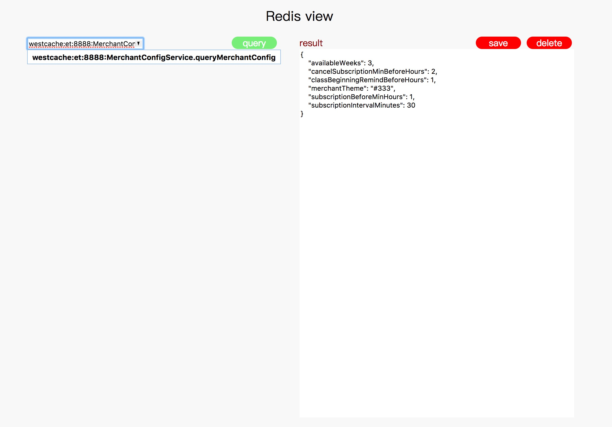

# go-redis-web
A simple web tool for redis to get, set, del redis value

## Quick start
```bash
$git clone https://github.com/zhangcunxin/go-redis-web.git
$go get github.com/garyburd/redigo/redis
$cd go-redis-web/src/server
$go build
$./server
```

###
本地编译Linux版本
```
本地编译Linux版本(bash) GOOS=linux GOARCH=386 CGO_ENABLED=0 go build -o redis.view.linux
```

open browser

http://localhost:9001



